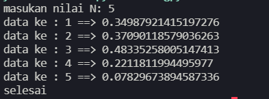
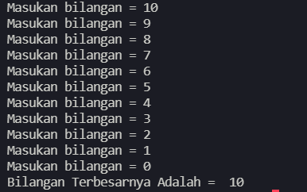
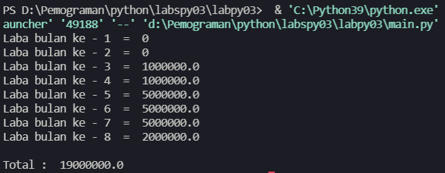

# **Labpy03**

## **LOOPING**

- LOOPING sendiri artinya perulangan,dalam bahasa pemrograman merupakan suatu pernyataan untuk
  menguntruksi komputer agar melakukan sesuatu secara berulang.
- Terdapat 2 jenis perulangan dalam bahasa pemrograman python ,yaitu perulangan for & while .
  Dan seperti inilah contoh dari program looping pada python.

# **Algoritma latihan1.py**

```sh
print("masukan nilai N: 5 ")
import random

a = 5
b = 0
for i in range(a):
    i = random.uniform(.0, .5)
    b += 1
    print("data ke :", b, "==>", i)
print("selesai")
```

1. "print" : berfungsi untuk mencetak atau menampilkan objek ke perangkat keluaran (layar) atau ke file teks.

2. "import" : fungsi lanjut yang dipanggil oleh statement import.

3. "random" : untuk menentukan suatu pilihan.

4. "range" : merupakan fungsi yang menghasilkan list. Fungsi ini akan menciptakan sebuah list baru dengan rentang nilai tertentu.

5. "uniform": digunakan untuk menampilkan bilangan float random dengan batas awal bilangan x, dan batas akhir bilangan y.

### **screenshot output program latihan1.py**



# **Algoritma Latihan2.py**

```sh
maxsimal = 0
while True:
    a = int(input("Masukan bilangan = "))
    if maxsimal < a:
        maxsimal = a
    if a == 0:
        break
print("Bilangan Terbesarnya Adalah = ", maxsimal)

```

1. "max" : fungsi bulid-in untuk mencari nilai tertinggi. Fungsi ini dapat diberikan sebuah parameter berupa angka.

2. "while" : disebut uncounted loop (perulangan yang tak terhitung), untuk perulangan yang memiliki syarat dan tidak tentu berapa banyak perulangannya.

3. "int" : berfungsi mengkonversi bilangan maupun string angka menjadi bilangan bulat (integer).

4. "if" = Bila suatu kondisi tertentu tercapai maka apa yang harus dilakukan. Dengan fungsi ini kita bisa menjalankan suatu perintah dalam kondisi tertentu.

5. "input" : masukan yang kita berikan ke program.

6. "break" : fungsi yang menghentikan operasi dibawahnya jika suatu kondisi yang ditentukan telah tercapai.

7. "print" : berfungsi untuk mencetak atau menampilkan objek ke perangkat keluaran (layar) atau ke file teks.

### **screenshot output program latihan2.py**



# **Algoritma main.py**

- Buat program sederhana dengan perulangan,
- Seorang pengusaha menginvestasikan uangnya untuk memulai usahanya
- Dengan modal awal 100 juta
- Pada bulan pertama dan kedua belum mendapatkan laba
- Pada bulan ketiga baru mulai mendapatkan laba sebesar 1%
- Pada bulan kelima pendapatan meningkat 5%
- Selanjutnya pada bulan ke-8 mengalami penurunan keuntungan sebesar 2%
- Sehingga laba menjadi 3%
- Hitung total keuntungan selama 8 bulan berjalan usahanya

```sh
a = 100000000
for i in range(1, 9):
    if (i >= 1 and i <= 2):
        b = a * 0
        print("Laba bulan ke -", i, " = ", b)
    if (i >= 3 and i <= 4):
        c = a * 0.01
        print("Laba bulan ke -", i, " = ", c)
    if (i >= 5 and i <= 7):
        d = a * 0.05
        print("Laba bulan ke -", i, " = ", d)
    if (i == 8):
        e = a * 0.02
        print("Laba bulan ke -", i, " = ", e)
        total = b + b + c + c + d + d + d + e
        print("\nTotal : ", total)
```

1. masukkan nilai a

2. gunakan for untuk perulangan dari 1 sampai 8.Perulangan for
   disebut counted loop (perulangan yang terhitung)

3. lalu gunakan if pertama untuk menentukan laba bulan ke 1 dan ke 2.masukan variabel (b) kalikan nilai (a) dengan data bulan 1 dan 2. cetak (x) dan (b)

4. lalu gunakan if kedua untuk menentukan laba bulan ke 3 dan ke 4.masukan variabel (b) kalikan nilai (a) dengan data bulan 3 dan 4. cetak (x) dan (c)

5. lalu gunakan if ketiga untuk menentukan laba bulan ke 5 sampai ke 7.masukan variabel (b) kalikan nilai (a) dengan data bulan 5 sampai 7. cetak (x) dan (d)

6. lalu gunakan if keempat untuk menentukan laba bulan ke 8.masukan variabel (b) kalikan nilai (a) dengan data bulan 8. cetak (x) dan (e)

7. lalu total keseluruhan.

8. cetak total

### **screenshot output program main.py**


